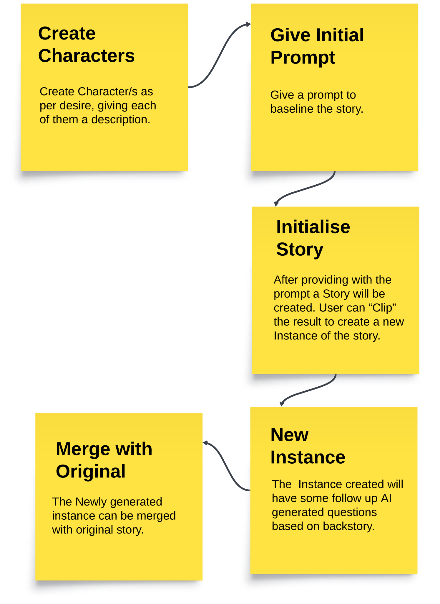

# StoryboardGPT

Introducing An artificial intelligence tool for generating film storyboard visuals, storyboardGPT .
This tool will have a potential to generate a story on it's own along with the visuals. The story
will partly conclude at the end of each chapter and will finish off with a captivating climax.
A story initiated by a User-A can be instantiated by User-B making it a loop for an endless
possibility of the story, kind of like what happens in a fandom.

## How to use it?

